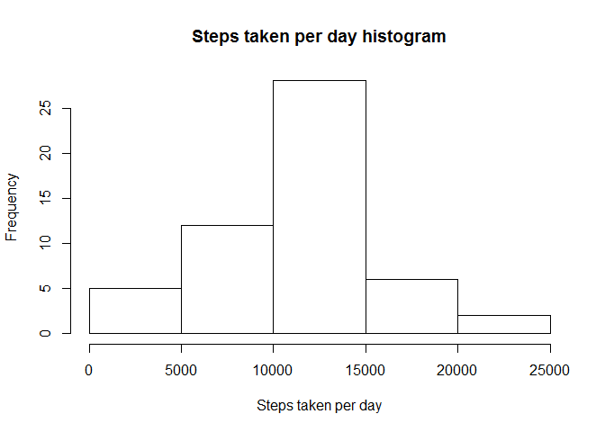
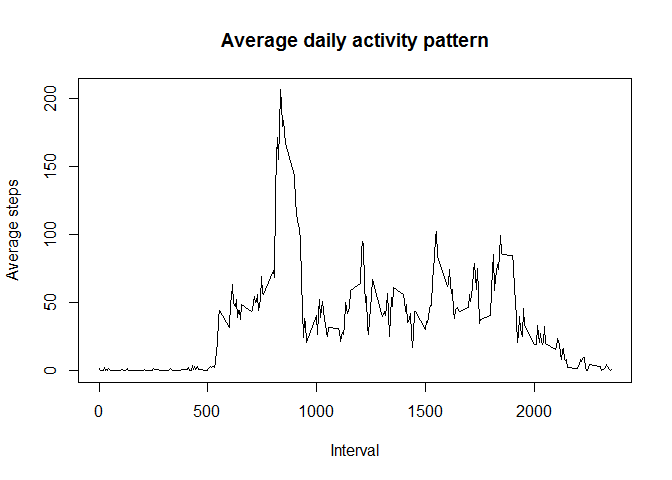
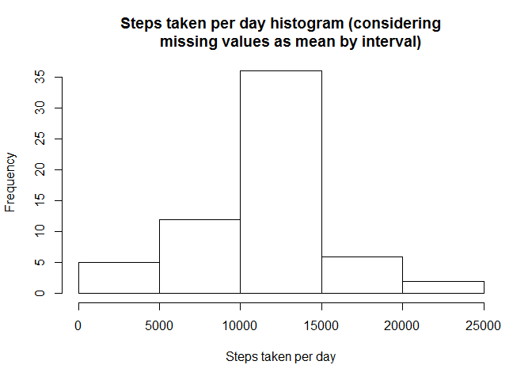
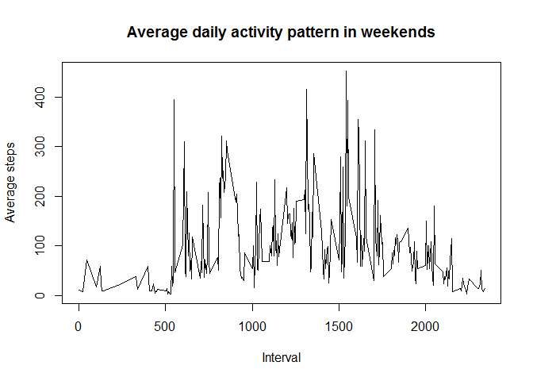
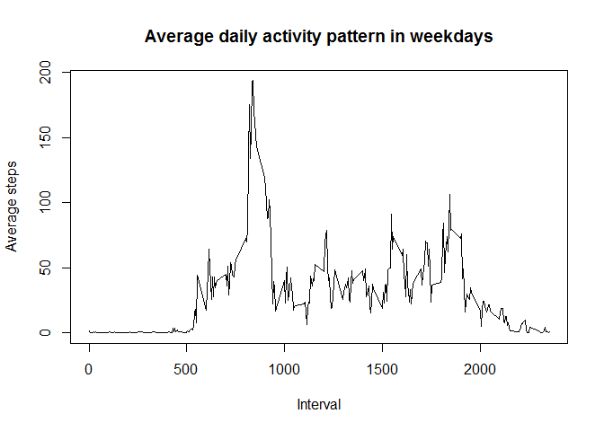

# Reproducible Research: Peer Assessment 1


## Loading and preprocessing the data

```r
unzip("activity.zip")
df <- read.csv("activity.csv")
```


## What is mean total number of steps taken per day?

```r
byDateSum <- aggregate(steps ~ date, data = df, sum)
meanTotalNumberOfStepsPerDay <- mean(byDateSum$steps)
medianTotalNumberOfStepsPerDay <- median(byDateSum$steps)
hist(byDateSum$steps, main = "Steps taken per day histogram", 
     xlab = "Steps taken per day")
```

 
  
Mean total number of steps taken per day: 1.0766 &times; 10<sup>4</sup>  
Median total number of steps taken per day: 10765  

## What is the average daily activity pattern?

```r
byIntervalMean <- aggregate(steps ~ interval, data = df, mean)
plot(byIntervalMean$interval, byIntervalMean$steps, 
     type="l", 
     main = "Average daily activity pattern",
     xlab = "Interval",
     ylab = "Average steps")
```

 

```r
bestInterval <- byIntervalMean$interval[which.max(byIntervalMean$steps)]
```
5-minute interval ID with max steps (on average across all the days in the dataset): 835  


## Imputing missing values
Fill missing data (steps) with mean of current interval.  
If no data for current interval available, then fill with 0.  
Column "steps" change name to "stepsProcessed" and type from "int" to "float".  
New dataframe will be in "dfProcessed" variable.  


```r
if("sqldf" %in% rownames(installed.packages()) == FALSE) {install.packages("sqldf")}
library(sqldf)
```

```
## Loading required package: gsubfn
## Loading required package: proto
## Loading required package: RSQLite
## Loading required package: DBI
## Loading required package: RSQLite.extfuns
```

```r
#strange, but if your use "steps" as a field name instead of "stepsProcessed", 
#then field type will be "int"" instead of "float"
sql<-"
    select     
    case 
    when base.steps is not null then base.steps
    when meanByInterval.steps is not null then meanByInterval.steps + 0.0
    else 0 end
    as stepsProcessed,  
    base.date, 
    base.interval 
    from 
    df as base 
    left join 
    (
        select base2.interval, avg(steps+0.0) as steps
        from df as base2
        where base2.steps is not null
        group by base2.interval
    ) as meanByInterval on 
    meanByInterval.interval = base.interval    
    "
dfProcessed<-sqldf(sql)
```

```
## Loading required package: tcltk
```

```r
byDateSumProcessed <- aggregate(stepsProcessed ~ date, data = dfProcessed, sum)
meanTotalNumberOfStepsPerDayProcessed <- mean(byDateSumProcessed$stepsProcessed)
medianTotalNumberOfStepsPerDayProcessed <- median(byDateSumProcessed$stepsProcessed)
hist(byDateSumProcessed$steps, main = "Steps taken per day histogram (considering
     missing values as mean by interval)", 
     xlab = "Steps taken per day")
```

 

Mean total number of steps taken per day: 1.0766 &times; 10<sup>4</sup>    
Median total number of steps taken per day: 1.0766 &times; 10<sup>4</sup>    


## Are there differences in activity patterns between weekdays and weekends?

```r
df2 <- cbind(dfProcessed, weekdays(dfProcessed$stepsProcessed))
colnames(df2)[4] <- "weekday"

sql<-"
    select interval, avg(stepsProcessed) as steps    
    from df2 
    where weekday = 'Sat' or weekday = 'Sun' 
    group by interval
    "
dfWeekend <-sqldf(sql)

plot(dfWeekend$interval, dfWeekend$steps, 
     type="l", 
     main = "Average daily activity pattern in weekends",
     xlab = "Interval",
     ylab = "Average steps")
```

 

```r
sql <- "
    select interval, avg(stepsProcessed) as steps    
    from df2 
    where weekday != 'Sat' and weekday != 'Sun' 
    group by interval
    "
dfWeekdays <-sqldf(sql)

plot(dfWeekdays$interval, dfWeekdays$steps, 
     type="l", 
     main = "Average daily activity pattern in weekdays",
     xlab = "Interval",
     ylab = "Average steps")
```

 

